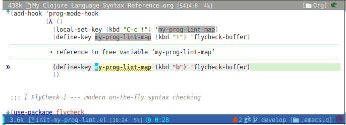

# flycheck-inline

Display flycheck error message with inline popup style.

# Screenshots



# Setup

If you use `use-package`.

```elisp
(use-package flycheck-inline
  :ensure t
  :config
  (flycheck-inline-mode 1)
  )
```
